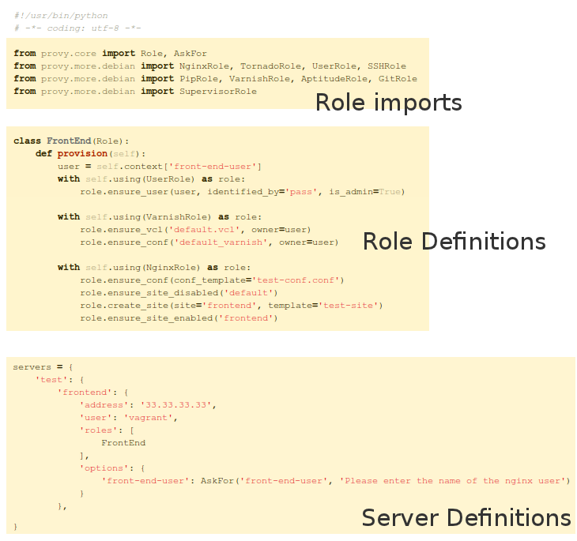

provyfile and Runtime Arguments
===============================

*provy* uses a python module called *provyfile.py* in order to retrieve the definitions of your roles, servers and the relationships between them.

This is the overall structure of a *provy* provisioning file. The first imports will be very similar among most your provyfile.py files. You'll always import Role and most of the time will use one of the other built-in roles.

After the imports, come your *Role* Definitions. This is where you'll specify how you want your servers to be built. You can find more about how to build roles in the :doc:`what-are-roles` and :doc:`using-roles` sections.

Last but not least, you describe your servers and how they relate to roles. This brings us to the *AskFor* parameter (*provy.core.AskFor*). This class allows you to specify that a given option for a given server should be filled at runtime, either by passing in the command line or by asking the user doing the provisioning.

*AskFor* takes two arguments: *key* and *question*. The *key* argument is needed to allow passing the argument when running *provy* (more on that in the next section). The *question* is used when *provy* asks the user running it for the parameter.

*AskFor* is really useful for sensitive data such as passwords. You don't want to expose this data in your provyfile in plain text. You just use an *AskFor* parameter for it and supply the information at runtime. Let's look at a sample of *AskFor* usage. ::

    servers = {
        'frontend': {
            'address': '33.33.33.33',
            'user': 'vagrant',
            'roles': [
                FrontEnd
            ],
            'options': {
                'mysql-db-password': 
                            AskFor('mysql-db-password', 
                                   'Please enter the password for the app database')
            }
        }
    }

This parameter can be supplied twofold: if you don't specify it in the console when calling *provy*, you will be asked for it. If you need to specify it in the console, just use its key like this::
                
    provy -s server -p password mysql-db-password=somepass

All arguments must take this form of key=value, with no spaces. The key must be exactly the same, case-sensitive.